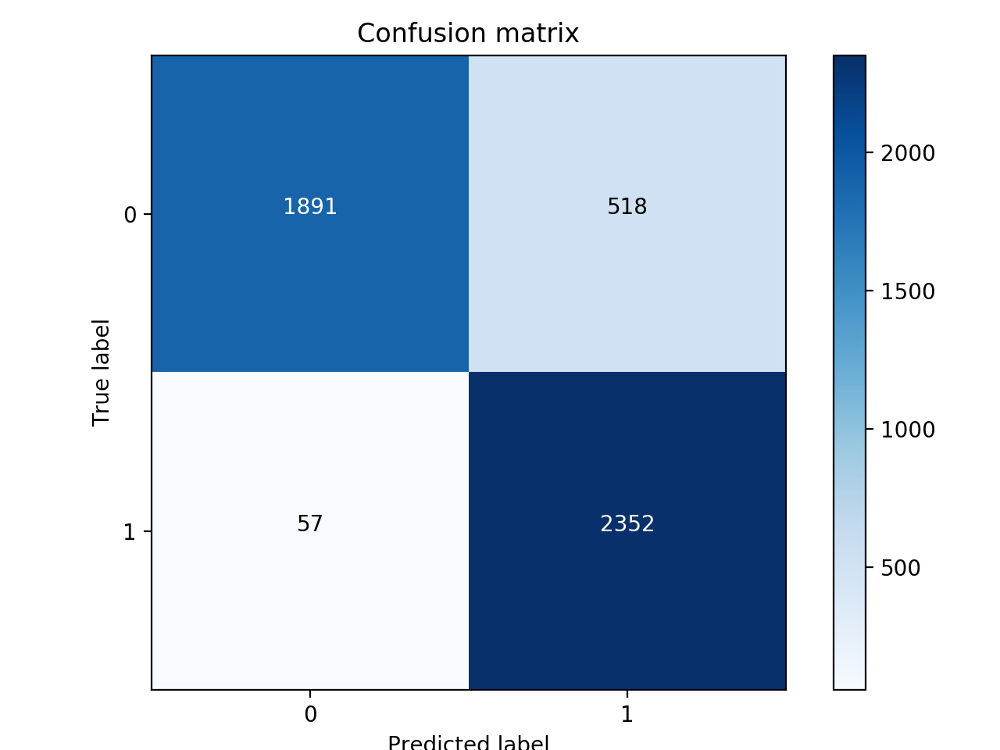
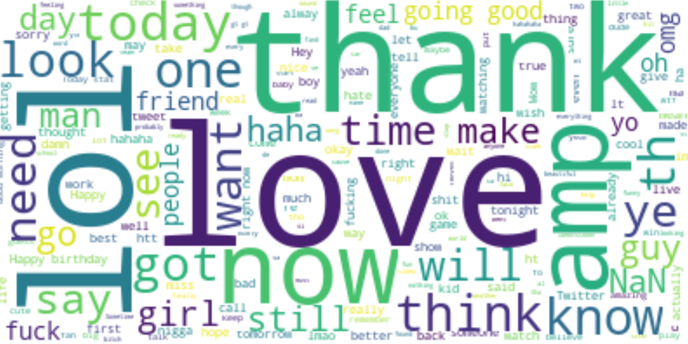
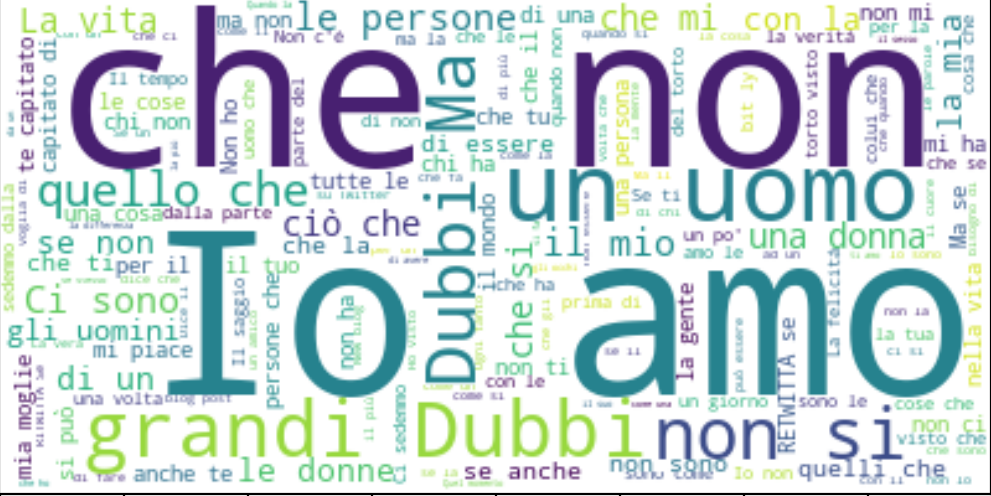

# TwitterBot Detection

*This project was originally used as my final capstone project for the Data Science Intensive program at [Galvanize Inc.](https://www.galvanize.com/denver-platte/data-science)*

## Background

In early 2018 Facebook conceded to investors that somewhere between 60 and 80 million fake profiles currently exist of the social network’s 2 billion users. This is a significant increase from 2016, when it last reported a mere 18 million counterfeit profiles.
 
In July, Twitter announced that it would be suspending 70 million accounts, an aggressive action prompted by continuous allegations that the social media platform exercises undue influence on news outlets, such as the U.S.’s most recent presidential elections or the caravan migration of workers from South America.
 
As people continue to depend on social media as their predominant source for news, information and overall cultural sentiment, it is important to recognize the threatening presence that spambots are as a tool to inflate or distort the actuality of things.
 
With anomaly detection, specifically that of fraud and autobot influence, are of strong personal interest, this project focuses strictly on the influx of spambots on Twitter and what features or perhaps tweet content could be used to detect whether a tweet is from a bot... or not.
 

## The Data
The data I worked with came from a data collecting and annotation agency called, Crowdflower (now [Figure Eight](https://www.figure-eight.com)) out of San Francisco, and  contains information on 4.5 million user profiles and 38 categories (features) that describe each profile
 
With data this large I decide to use a software, Spark, to partition data into subsets that could be worked on simultaneously with multiple machines.
 

## Exploratory Analysis

The first thing that needed to be addressed before moving forward was to see how imbalanced the data would and balance it using a under-sampling. Proceeding with the EDA process several distinctions popped out between genuine and fake profiles: the friends to followers ratio is heavily skewed with fakes. Bots tend to have an extremely disproportionate amount friends and fewer followers (in some cases 20 times more), than genuine users. They also add tweets to their favorites list and retweet more often.
 One of the most interesting things I noticed was that while genuine profiles are created consistently throughout the week, batches of spam users are released on a predictable schedule. In the case of this data set, bots were published on Tuesdays and Wednesdays.
 

## Modeling
### User Profiles
Profile level testing was done using Random Forest. Because a random forest model is built with multiple decision trees on a random subset of the data and a random subset of features at each split, I was able to determine that the most important features in classifying a bot or not are:
 
- the amount of status check-ins
- how many friends a user has
- the number of followers a profile has
- the amount of tweets that have been marked as 'favorites'
- the number of smaller groups that a twitter profile forms into lists
- when a profile is created
- the type of background image that is used.
 

Using only these features I was able to achieve a 92% accuracy score.
 
### Text Analysis
I then looked into the content of tweets to see if there were any features (words) that differentiate bots from real people. I chose to use a logistic regression classifier to do so.
 

You can see from this word cloud that genuine users like tweeting words like ‘love, and ‘lol’ and ‘thank’. When I went to see what the bots were tweeting I noticed they were all in Italian, and that my model may have been predicting English language or Italian.
 

 I decided to limit my data to that of only Italian tweets, balance the data and test my model once more.
 
<b>*Real Italians*</b>
 

<b>*Synthetic Italians*</b>
 

 
 I could see that real Italians do speak in a humanistic and similar way to that of genuine tweeters made in english, yet these spam Italians shared a heavy sentiment. With a balanced Italians-Only dataset I was able to achieve a 94% accuracy.

## Future work
Considering only the context above, I'd want to delve deeper into this particular dataset and determine what might be the reason behind the synthetic Italian's negative outlook- what might've been going on politically or commercially to have words with such heavy connotation.
  What I'd like most to do is dive into the text analysis further and see if it can be applied regionally to places like Japan, Russia, and areas in South America. I'd also like to conitnue implementing models using Spark, including Gradient Boosting methods and eventually apply auto-encoding to detect these spambots.
 
## Conclusion
If you also feel engaged by this topic or have questions about this project, please feel free to reach out. I can be reached on LinkedIn at [linkedin.com/in/haven-gumucio](https://www.linkedin.com/in/haven-gumucio/) or via email at haven.gumucio@gmail.com
